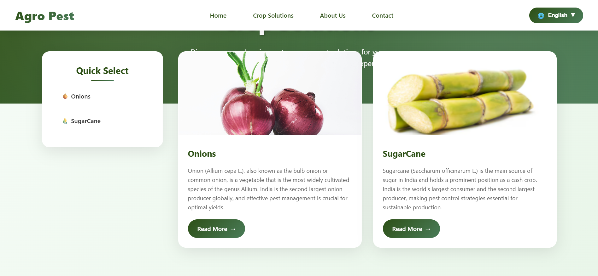

# Agropest

Agropest is a comprehensive web-based platform designed for agricultural excellence, providing advanced crop protection solutions, product management, and expert consultation for farmers and agri-businesses. Developed for Netravathi Agro Kendra, it empowers users with modern tools for sustainable farming and pest management.

## 🌱 Project Overview
Agropest offers:
- Product management for fertilizers, pesticides, and crop protection chemicals
- Crop-specific solutions and information
- Admin dashboard for analytics and product control
- Contact and support for farmers
- Secure authentication for admin
- Modern, responsive UI

## 🚀 Features
- **Admin Dashboard:** View website statistics, manage products, and monitor user activity
- **Product Management:** Add, update, and delete agricultural products with images and details
- **Crop Solutions:** Detailed crop management guides (e.g., Onions, Sugarcane)
- **Contact & Support:** Farmers can reach out for expert advice
- **Secure Login:** Admin authentication with session management
- **Responsive Design:** Works on desktop and mobile
- **Multilingual Support:** The entire website can be automatically translated into English, Kannada, or Hindi based on the user's selection, making it accessible to a wider audience.

## 🛠️ Tech Stack
- PHP (Backend)
- MySQL (Database)
- HTML, CSS, JavaScript (Frontend)
- Docker & Docker Compose (for local development)

## 📝 Admin Credentials
- **Username:** `Admin`
- **Password:** `Admin@123`

> **Note:** Change the default admin credentials after first login for security.

## 🖥️ Dashboard Screenshot

## 🎬 Demo Animation & Screenshots

### Demo Animation

### Screenshots

## ⚙️ Setup Instructions

### Using Docker (Recommended)
1. Ensure Docker and Docker Compose are installed.
2. Run `docker-compose up --build` in the project root.
3. Access the app at [http://localhost:8080](http://localhost:8080)
4. Access phpMyAdmin at [http://localhost:8081](http://localhost:8081) (DB: user_db, user: user, password: password)

### Manual Setup
1. Import `user_db.sql` into your MySQL server.
2. Configure database credentials in `config.php`.
3. Serve the project directory with XAMPP or any PHP server.

## 📂 Project Structure
- `index.php` - Home page
- `Admin/` - Admin dashboard and product management
- `Crops/` - Crop-specific guides
- `Images/` - All images and screenshots
- `Login/` - Authentication pages
- `products.php` - Product listing
- `contact.php` - Contact form
- `db123.sql` - Database schema and sample data

## 📞 Contact & Support
For support, you can drop a mail at Surajjangavali80@gmail.com.

## 📜 License
Anyone can use this project both for educational and commercial purposes
